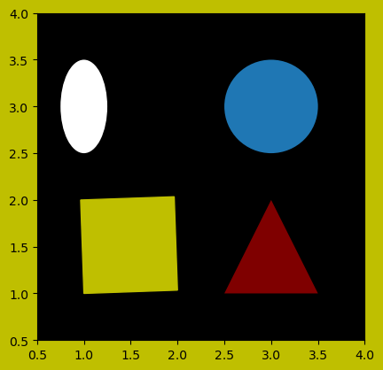
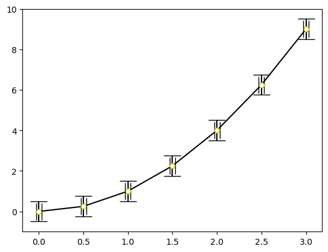

# fig and ax
- fig has these arguments
    - num: identifier for the figure
    - figsize: (width, height) in inches
    - dpi: dots per inch
    - facecolor: background color
    - edgecolor: border color
```
import matplotlib.pyplot as plt
fig = plt.figure(num='my_figure', figsize=(4, 2), facecolor='red')
```
- ax is Axes object. It is a single plot containing data, labels, ticks, ...
```
fig = plt.figure()
ax = fig.add_subplot(3, 1, (1, 2))
# 3 is three rows
# 1 is one column
# (1, 2) takes the first and second places (it starts from upper left to right and down)
```
- add_subplot has argument subplot_kw for attributes of axes such as facecolor, aspect ratio...
```
fig = plt.figure()
ax = fig.add_subplot(subplot_kw=dict(facecolor='red'))
```
- combining definitions for fig and ax
```
fig, ax = plt.subplots(nrows=2, ncols=2, facecolor='black', subplot_kw=dict(facecolor='yellow'))
```
- plt.subplots has argument gridspec_kw for specifying the grid for subplots
```
fig, ax = plt.subplots(nrows=2, ncols=2, gridspec_kw={'width_ratios': [2, 1], 'height_ratios': [1, 2]})
# different sizes for each plot
```
- saving figures
    pdf eps png ...
```
plt.savefig('my_figure.eps')
```

# Multiple Subplots
1. method
```
import matplotlib.pyplot as plt
fig = plt.figure()
ax1 = fig.add_subplot(2, 2, 1) # top left
ax2 = fig.add_subplot(222) # top right
ax3 = fig.add_subplot(223) # bottom left
ax4 = fig.add_subplot(224) # bottom right
```
2. method
```
fig, ax = plt.subplots(2, 2)
ax1 = ax[0, 0]
ax2 = ax[0, 1]
ax3 = ax[1, 0]
ax4 = ax[1, 1]
```
- Matplotlib can arrange title, subtitle, legends, sublegends... by itself
```
plt.tight_layout()
```

# Customizing Plots

## Markers
- markersize=ms markerfacecolor=mfc markeredgecolor=mec markeredgewidth=mew
- ^ v . o + x D(Diamond) s(Square) *


```python
import matplotlib.pyplot as plt
# creating data
x = [0, 0.5, 1, 1.5, 2, 2.5, 3]
y = [0, 0.25, 1, 2.25, 4, 6.25, 9]
# plotting
fig, ax = plt.subplots()
ax.plot(x, y, marker='D', mfc='black', mec='y', mew=1)
plt.show()
```


    

    


## Colors
- b g r y k (black) w c(cyan) m(magenta)
- tab:blue tab:orange tab:green tab:red tab:purple tab:brown tab:pink tab:gray tab:olive tab:cyan


```python
fig, ax = plt.subplots()
ax.plot(x, y, c='tab:blue')
plt.show()
```


    

    


## Line Styles
- linestyle ls : --(dashed) -(solid) :(dotted) -.(dash-dot)
```
fig, ax = plt.subplots()
ax.plot(x, y, ls='--')
plt.show()
```
    - set_dash for customizing linestyle
```
line = plt.plot(x, y)
line[0].set_dashes([2,4,8,4,2,4]) # dot-dash-dot # 2 is dot, 4 is space, 8 is dash
```

# Adding Elements to Plots

## Limits


```python
import matplotlib.pyplot as plt
# creating data
x = [0, 0.5, 1, 1.5, 2, 2.5, 3]
y = [0, 0.25, 1, 2.25, 4, 6.25, 9]
# plotting
fig, ax = plt.subplots()
ax.plot(x, y)
ax.set_xlim(0, 2)
ax.set_ylim(bottom = 1)
plt.show()
```


    

    


## Gridlines
- customization
    - linestyle, linewidth, color
    - which can take 'minor', 'both', 'major'


```python
# vertical gridlines
fig, ax = plt.subplots()
ax.plot(x, y)
ax.xaxis.grid(True)
plt.show()
```


    

    


```python
# horizontal gridlines
fig, ax = plt.subplots()
ax.plot(x, y)
ax.yaxis.grid(True)
plt.show()
```


    

    


```python
# all gridlines
fig, ax = plt.subplots()
ax.plot(x, y)
ax.grid(True)
plt.show()
```


    

    


## Log Scales
- 'log' 'symlog' 'logit'
```
fig, ax = plt.subplots()
ax.plot(x, y)
ax.set_xscale('log')
ax.set_yscale('log')
plt.show()
```

## Legend, Label, Title
- legend
    - 'best'=0 'upper right'=1 'upper left'=2 'lower left'=3 'lower right'=4 'right'=5
    - 'center left'=6 'center right'=7 'lower center'=8 'upper center'=9 'center'=10
- title
    - 'center' 'left' 'right'


```python
fig, ax = plt.subplots()
ax.plot(x, y, label='A Line')
ax.set_xlabel('x axis')
ax.set_ylabel('y axis')
ax.legend(loc='best')
ax.set_title('An Example', loc='left')
plt.show()
```


    

    


### . Font Properties
- fontsize takes 12, 16,...
- fontname takes 'Arial', 'Courier',...
- family takes 'sans-serif', 'cursive', 'monospace',...
- fontweight takes 'normal', 'bold',...
- fontstyle takes 'normal', 'italic',...
- color
```
ax.set_title('An Example', fontsize=18, fontname='Arial', c='b')
```
- setting font for all
```
from matplotlib import rc
font_properties = {'family':'monospace', 'weight':'bold', 'size':20}
rc('font', **font_properties)
```

## Ticks and Tick Marks


```python
# setting ticks
fig, ax = plt.subplots()
ax.plot(x, y)
ax.set_xticks([0, 1, 3])
ax.set_yticks([-1, 2, 5])
plt.show()
```


    

    


```python
# setting tick labels
fig, ax = plt.subplots()
ax.plot(x, y)
ax.set_xticks([0, 1, 3])
ax.set_yticks([-1, 2, 5])
ax.set_xticklabels(['a', 'b', 'c'])
ax.set_yticklabels(['d', 'e', 'f'])
plt.show()
```


    

    


```python
# choosing position
fig, ax = plt.subplots()
ax.plot(x, y)
ax.set_xticks([0, 1, 3])
ax.set_xticklabels(['a', 'b', 'c'])
ax.xaxis.set_ticks_position('top')
plt.show()
```


    

    


- turning on minorticks
```
ax.minorticks_on()
```

- customizating tick parameters
    - axis takes 'x', 'y', 'both'
    - which takes 'major', 'minor', 'both'
    - direction takes 'in', 'out', 'inout'
    - length
    - width
    - pad: distance between tick marks and line
    - labelsize
    - color
    - labelcolor


```python
fig, ax = plt.subplots()
ax.plot(x, y)
ax.set_xticks([0, 1, 3])
ax.set_yticks([-1, 2, 5])
ax.set_xticklabels(['a', 'b', 'c'])
ax.set_yticklabels(['d', 'e', 'f'])
ax.tick_params(which='major', width=5, direction='inout')
ax.minorticks_on()
ax.tick_params(which='minor', length=20, direction='in')
plt.show()
```


    

    


## Annotating

### . Adding Text
- argument: transform=ax.transAxes makes axis coordinates. 0,0 is lower left. 1,1 is upper right


```python
import matplotlib.pyplot as plt
# creating data
x = [0, 0.5, 1, 1.5, 2, 2.5, 3]
y = [0, 0.25, 1, 2.25, 4, 6.25, 9]
# plotting
fig, ax = plt.subplots()
ax.plot(x, y)
ax.text(1, 2, 'TeXt')
plt.show()
```


    

    


### . Adding Arrows with Text
- argument: xycoords takes 'data'(default), 'axes fraction'(0,0 is lower left of plot), 'figure fraction'(0,0 is lower left of figure)
- argument: arrowprops specifies properties and style of arrow


```python
fig, ax = plt.subplots()
ax.plot(range(15), range(15), 'o')
ax.annotate('default line', xy=(1.5, 1), xytext=(10, 1), arrowprops={'arrowstyle':'-'}, va='center')
ax.annotate('dashed line', xy=(2.5, 2), xytext=(10, 2), arrowprops={'arrowstyle':'-', 'ls':'dashed'}, va='center')
ax.annotate('default arrow', xy=(3.5, 3), xytext=(10, 3), arrowprops={'arrowstyle':'->'}, va='center')
ax.annotate('thick blue arrow', xy=(4.5, 4), xytext=(10, 4), arrowprops={'arrowstyle':'->', 'color':'b', 'lw':3}, va='center')
ax.annotate('double-headed arrow', xy=(5.5, 5), xytext=(10, 5), arrowprops={'arrowstyle':'<->'}, va='center')
ax.annotate('closed headed arrow', xy=(6.5, 6), xytext=(10, 6), arrowprops={'arrowstyle':'-|>'}, va='center')
plt.show()
```


    

    


### . Adding Lines
- customizing with color, lw, ls


```python
# 1. method
fig, ax = plt.subplots()
ax.hlines(0, 5, 2) # y, xmax, xmin
ax.vlines(3, -1, 1) #x, ymin, ymax
plt.show()
```


    

    


```python
# 2. method
fig, ax = plt.subplots()
ax.axhline(10) # a line across whole of x-axis at y = 10
ax.axvline(5) # a line across whole of y-axis at x=5
plt.show()
```


    

    


### . Adding Rectangles
- argument: alpha sets the transparency of the bars from 0 to 1
- argument: hatch sets the fill pattern. Its possible values: / | x + o O *
- argument: color, edgecolor, facecolor, fill(True or False), ls, lw


```python
fig, ax = plt.subplots()
ax.axhspan(1, 3)
ax.axvspan(1, 2, color='r', alpha=0.3)
plt.show()
```


    

    


### . Using Subpacket patches


```python
import matplotlib.pyplot as plt
from matplotlib.patches import Polygon, Circle, Rectangle, Ellipse
fig, ax = plt.subplots(subplot_kw=dict(aspect='equal', facecolor='k'), facecolor='y')
ax.set_xlim(0.5, 4)
ax.set_ylim(0.5, 4)
square = Rectangle((1, 1), 1, 1, 2, color='y')
circle = Circle((3, 3), 0.5)
triangle = Polygon(((2.5, 1), (3.5, 1), (3, 2)), facecolor='r', alpha=0.5)
ellipse = Ellipse((1, 3), 0.5, 1, facecolor='w')
for shape in (square, circle, triangle, ellipse):
    ax.add_patch(shape)
plt.show()
```


    

    


## Modifiying details
- length of x-axis = length of y-axis
```
ax.axis('equal')
```
- Removing ticks, marks, labels, legends, title
```
ax.xaxis.set_visible(False)
ax.yaxis.set_visible(False)
```
- Removing axes frame
```
ax.axis('off')
```

# Bar Charts
- Bar charts are histograms
- argument: width can take a scalar or an array
- argument: bottom is the y-coordinates of the bottom
- argument: height is the sequence of heights for the bars
- argument: color, edgecolor, lw
- argument: xerr, yerr for error bar
- argument: error_kw for customization of error bar
- argument: align takes 'left', 'center', 'right'
- argument: log takes 'True' or 'False'
- argument: orientation takes 'vertical' or 'horizontal'
- argument: hatch sets the fill pattern. It takes / \ | - + x . o O *


```python
import matplotlib.pyplot as plt
# creating data
text = 'mkoplinjibhuyvgtcftrxdrezsezwaqwzwsexrxctrctfcvtvygvygbhubnuninmmkopl'
letters = 'ABCDEFGHIJKLMNOPQRSTUVWXYZ'
lcount = dict([letter, 0] for letter in letters)
for letter in text:
    lcount[letter.upper()] += 1
# plotting
fig, ax = plt.subplots()
ax.bar(range(26), [lcount[letter] for letter in letters], width=0.8, align='center')
ax.set_xticks(range(26))
ax.set_xticklabels(letters)
plt.show()
```


    

    


```python
# A stacked bar chart
import matplotlib.pyplot as plt
# creating data
years = [2001, 2002, 2003]
Hydro = [3, 3.5, 4]
Wind = [7, 9, 13]
Biomass = [6, 5, 7]
# plotting
fig, ax = plt.subplots()
names = ['Hydro', 'Wind', 'Biomass']
bar = [None]*3
bar[0] = ax.bar(years, height=Hydro, hatch='*', color='b', alpha=0.8)
bar[1] = ax.bar(years, height=Wind, hatch='/', color='g', alpha=0.3)
bar[2] = ax.bar(years, height=Biomass, hatch='x', color='r', alpha=0.3)
ax.set_xticks(years)
plt.xticks(rotation=90)
plt.legend(bar, names, loc=0)
plt.show()
```


    

    


# Pie Charts
- argument: colors takes an array
- argument: labels takes an array
- argument: explode takes a scalar from 0 (0 is no explode)
- argument: shadow takes True and False
- argument: startangle takes a scalar of degree
- argument: autopct 
- argument: pctdistance is radial position of atuopct text (0.6 is default)
- argument: labeldistance is radial position of label text
- argument: radius (1 is default)


```python
import matplotlib.pyplot as plt
# creating data
categories = ['Meat', 'Vegatable', 'Rice']
expenditure = [15, 12, 5]
# plotting
fig, ax = plt.subplots()
ax.axis('equal')
ax.pie(expenditure, colors=['b','r','g'], shadow=True, 
       startangle=180, explode=[0,0.2,0], labels=categories,
       labeldistance=1.3, autopct='%.1f%%', pctdistance=0.8)
plt.show()
```


    

    


# Scatter Plot


```python
import matplotlib.pyplot as plt
# creating data in 2000
countries = ['US', 'China', 'S. Korea']
birth_rate = [14.2, 13.5, 9.5]
life_expectancy = [78.8, 75.2, 81.3]
GDP = [377, 26.4, 167]
# plotting
fig, ax = plt.subplots()
ax.scatter(birth_rate, life_expectancy, c=range(3), s=GDP)
plt.show()
```


    

    


# Error Bars
- arguments: x, y, yerr, xerr, fmt(plot format), ecolor(color for error bars), elinewidth, capsize(2 line for edge), errorevery
- type of values for yerr, xerr: None, scalar (0.2), array ((0.1, 0.2)), array like shape (2, n)


```python
import matplotlib.pyplot as plt
# creating data
x = [0, 0.5, 1, 1.5, 2, 2.5, 3]
y = [0, 0.25, 1, 2.25, 4, 6.25, 9]
# plotting
fig, ax = plt.subplots()
# yerr = ((0.1, 0.2, 0.3, 0.4, 0.5, 0.6, 0.7), (0.01, 0.02, 0.03, 0.04, 0.05, 0.06, 0.07))
ax.errorbar(x, y, yerr=0.5, xerr=0.03, marker='o', color='k', mfc='w', mec='y', ls='-', capsize=10)
plt.show()
```
    

    

